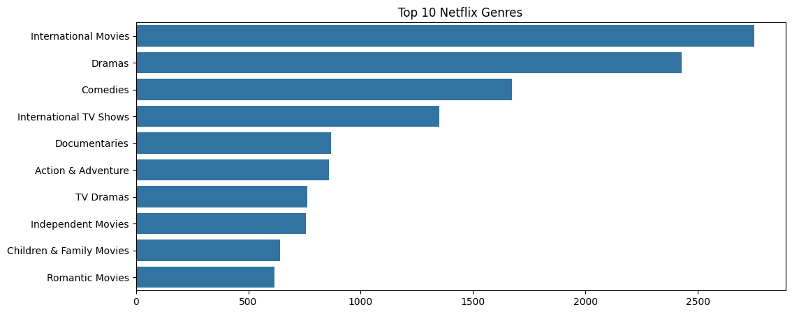
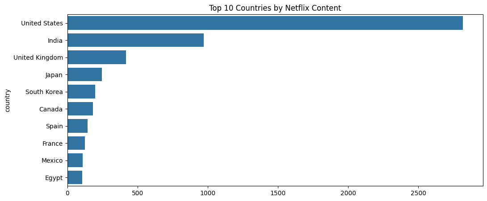
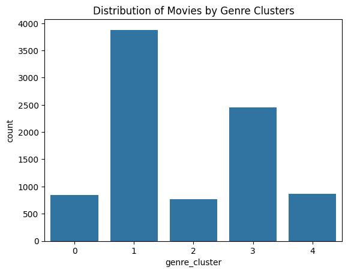

# Analysis of Netflix Content Preferences

##  Project Overview  
This data‑analysis project explores how Netflix content (movies and TV shows) varies across time, genres, and countries. The goal is to understand viewer preferences and content trends, as well as to segment content using clustering techniques.

## 📊 Dataset  
- **Source:** Netflix Movies and TV Shows dataset (Kaggle)  
- **Key Features:** title, type (Movie/TV Show), release year, country, listed genres, duration, etc.

## 🔍 Analysis Steps  
1. **Exploratory Data Analysis (EDA)**  
   - Distribution of titles by type (Movie vs TV Show)  
   - Number of releases per year  
   - Distribution of content by country  
   - Top genres and their frequencies  

2. **Visualization**  
   - Static plots (Seaborn / Matplotlib)  
   - Interactive visualizations (Plotly)  

3. **Clustering**  
   - Multi-label genre binarization  
   - KMeans clustering to group titles by genre similarity  
   - Comparative clustering by countries  

4. **Comparative Analysis**  
   - Trends of content production by country over time  
   - Differences in genre diversity across regions  

## 📈 Metrics & Key Results  
- **Total titles analyzed:** ~ 8,800 (пример)  
- **Number of unique genres:** ~ 40  
- **Top genre:** *Dramas* (пример)  
- **Top country by content:** *United States* (пример)  
- **Clustering:** 5 genre clusters — распределение видно на графике  
- **Trend:** steady growth of Netflix releases since 2008 (пример)

## 📊 Visualizations  
- **Top 10 Genres**  
    
- **Releases Per Year**  
    
- **Top Countries by Content Volume**  
    
- **Genre Clustering Distribution**  
    
- **Interactive Plot — Releases by Year & Country**  
  [View Interactive Plot](visuals/releases_per_year_by_country.html)

## 🔮 Future Work  
- Sentiment analysis of show/movie descriptions (to see if “feel” of genre + popularity correlates)  
- Build a **recommendation system** based on country + genre clusters  
- Use more advanced clustering (hierarchical clustering, DBSCAN) to find niche content groups  
- Develop a dashboard (e.g. with Dash or Streamlit) for interactive exploration  

## 🛠️ Technologies & Tools  
- **Languages / Libraries:** Python, Pandas, Numpy, Seaborn, Matplotlib, Plotly, Scikit‑learn  
- **Development Environment:** Jupyter Notebook / Google Colab  

##  How to Run  
1. **Clone the repository:**  
   ```bash
   git clone git@github.com:kangereyevTimur/Analysis-of-Netflix-content-preferences.git
   cd Analysis-of-Netflix-content-preferences
Install dependencies:
pip install -r requirements.txt
Open the Notebook:
jupyter notebook notebooks/netflix_analysis.ipynb
# or open in Google Colab  
Run cells to regenerate visualizations; HTML interactive plots will be saved to visuals/.
📁 Repository Structure
├── data/                   # Dataset CSV  
├── notebooks/              # Analysis Notebook  
├── visuals/                # Saved PNGs & HTML plots  
├── README.md               # This README  
├── requirements.txt        # Python dependencies  
└── LICENSE                 # License file (if any)  
👥 Authors
Timur Kangereyev
Zhanel Karimzhanova
📄 License
This project is licensed under the MIT License.
